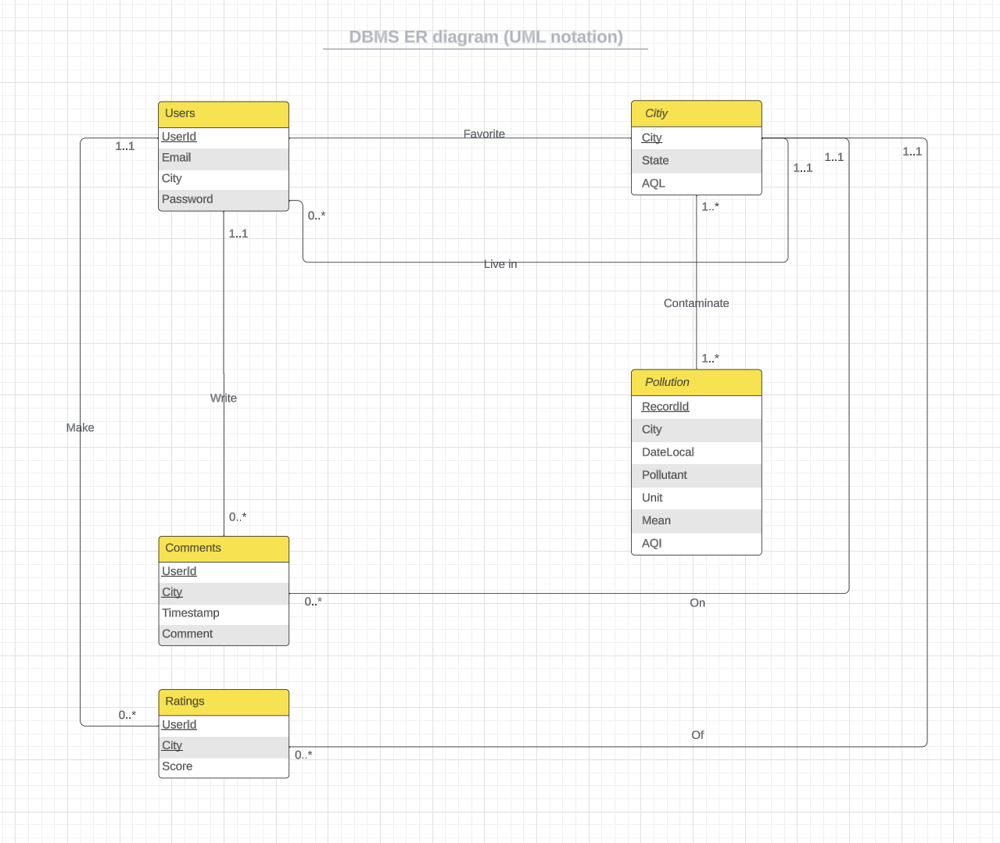

# Stage 2

# UML Diagram



# Description

## Entities:

### Pollution:

1. RecordId: a unique identifier to distinguish between records. This should be an `int` attribute and primary key for this table.
2. City: a `string` attribute, the name of the city where we record the pollution.
3. Date Local: a `string` attribute, the date we record the pollution.
4. Pollutant: a `string` attribute, the name of the pollutant.
5. Unit: a `string` attribute, unit of pollutant.
6. Mean: an `int` attribute, the mean value of pollution.
7. AQI: an `int` attribute, the air quality index at that time.

- We assume that each pollution record has a unique `RecordId`.
- The other attributes can be identical for different pollution records.

### Users:

1. UserId: a unique identifier to distinguish between users. This should be a `string` attribute and primary key for this table.
2. Email: a `string` attribute, the email address of the user.
3. City: a `string` attribute, the city where the user lives.
4. Password: a `string` attribute, password for login.

- We assume that each user has a unique UserId.
- We assume that each user uses a unique email.
- Attribute City and Password can be identical for different users.

### Comments:

1. UserId: `foreign key` to identify the user.

1. City: `foreign key` to identify the city.
1. Timestamp: a `Timestamp` attribute, the date we record the pollution. The time in the format “xxxx-xx-xx” indicates what time the comments are made
1. Comment: a `string` attribute, that contains the specific comments made by users

- We assume each user can comment on each city at most once.
- We chose the `combination of UserId and City as the primary key`.
- Each comment might have an identical timestamp or comment.

### Ratings:

1. UserId: `foreign key` to identify the user.
2. City: `foreign key` to identify the city.
3. Score: an `int` attribute that contains the score of the city which indicates the rating

- We assume that each user can only give one rating for each city.
- We chose the `combination of UserId and City as the primary key`.

### City:

1. City: a `foreign key` to identify the city.
2. State: a `string` attribute that contains the name of the state to which the city belongs to.
3. AQL: an `int` attribute that describes the air quality level of the city.

- We assume that each city has a unique name.
- Different cities can belong to the same state.
- Different cities can have the same AQL (air quality level).

## Relations

**We have 1-1, 1-many, and many-many included in our UML diagram.**

1. Write — **one-to-one & one-to-many**

   `write` is a relation between `Users` and `Comments` to indicate the comments each user made to a certain city. This includes a **one-to-many** and **one-to-one relation**, for each user can comment on multiple cities, and each city can be commented on by multiple users. However, we do have restrictions based on the following assumptions:

   One user can only comment on the same city once. This will ensure that we can identify the desired records as quickly as possible.

2. Make — **one-to-one & one-to-many**

   `Make` is a relation between `Users` and `Ratings` to indicate the rating each user made to a certain city. This includes a **one-to-many** and **one-to-one relation**, for each user can rate on multiple cities, and each city can be created by multiple users. However, we do have restrictions based on the following assumptions:

   One user can only rate the same city once. This will ensure that we can identify the desired records as quickly as possible.

3. Favorite — **one-to-one & one-to-many**

   `Favorite` is a relation between `Users` and `City` to mark the favorite cities of each user. This includes a **one-to-many** and **one-to-one relation**, for each user can have multiple favorite cities, and each game can be favorited by multiple users. However, we do have restrictions based on the following assumptions:

   One user can only favorite the same city once. This will ensure that we can identify the desired records as quickly as possible.

4. Lived in — **one-to-one & one-to-many**

   `Lived in` is a relation between `Users` and `City` to indicate the city where the user lives. This includes a **one-to-many** and **one-to-one relation**, for each city can have multiple users, and each user has only one city to live in. However, we do have restrictions based on the following assumptions:

   One user can only live in one city. This will ensure that we can identify the desired records as quickly as possible.

5. Contaminate - **many-to-many**

   `Contaminate` is a relation between `Pollution` and `City` to indicate the pollutants in different cities. This includes a **many-to-many relation**, different cities can have different pollutants.

6. On - **one-to-one & one-to-many**

   `On` is a relation between `Comment` and `City` to indicate the comments made to a city. This includes a **one-to-many** and **one-to-one relation**, for each city can have multiple comments, and each comment can only be about one city. However, we do have restrictions based on the following assumptions:

   We assume each user can comment on each city at most once.

7. Of - **one-to-one & one-to-many**

   `Of` is a relation between `Rating` and `City` to indicate the comments made about a city. This includes a **one-to-many** and **one-to-one relation**, different cities might have the same rating, but a city only has a unique rating. However, we do have restrictions based on the following assumptions:

   We assume that each user can only give one rating for each city.

# Normalization

We decided to use `3NF` because it can preserve dependencies, but we also noticed that `both BNCF and 3NF produced uniform results for all entities`. During the process, we found one dependency (City → State) transitive, which violated the rule for 3NF, so we created a new Table called City that represented such dependency.

**The final schema adheres to the 3NF normal form as follows:**

## Pollution:

### FDs:

- RecordId → City, DateLocal, Pollutant, Unit, Mean, AQI

### Minimal Basis:

- RecordId → City
- RecordId → DateLocal
- RecordId → Pollutant
- RecordId → Unit
- RecordId → Mean
- RecordId → AQI

## Users:

### FDs:

- UserId → Email, City, Password
- Email → UserId, City, Password

### Minimal Basis:

- UserId → Email
- UserId → City
- UserId → Password

## Comments:

### FDs:

- UserId, City → Timestamp, Comment

### Minimal Basis:

- UserId, City → Timestamp
- UserId, City → Comment

## Ratings:

### FDs:

- UserId, City → Score

### Minimal Basis:

- UserId, City → Score

## City:

### FDs:

- City → State, AQL

### Minimal Basis:

- City → State
- City → AQL

# Relational Schema

### Pollution

```sql
Pollution(
	RecorodId: INT[PK],
	City: VARCHAR(100)[FK to City.City],
	DateLocal: VARCHAR(100),
	Pollutant: VARCHAR(100),
	Unit: VARCHAR(100),
	Mean: INT,
	AQI: INT
)
```

### Users

```sql
Users(
	UserId: VARCHAR(100)[PK],
	Email: VARCHAR(100),
	City: VARCHAR(100)[FK to City.City],
	Password: VARCHAR(255)
)
```

### Comments

```sql
Comments(
	UserId: VARCHAR(100)[FK to Users.UserId],
	City: VARCHAR(100)[FK to City.City],
	Comments: VARCHAR(100)
)
```

### Rating

```sql
Rating(
	UserId: VARCHAR(100)[FK to Users.UserId],
	City: VARCHAR(100)[FK to City.City],
	Score: INT
)
```

### City

```sql
City(
	City: VARCHAR(100)[PK],
	State: VARCHAR(100),
	AQL: INT
)
```
