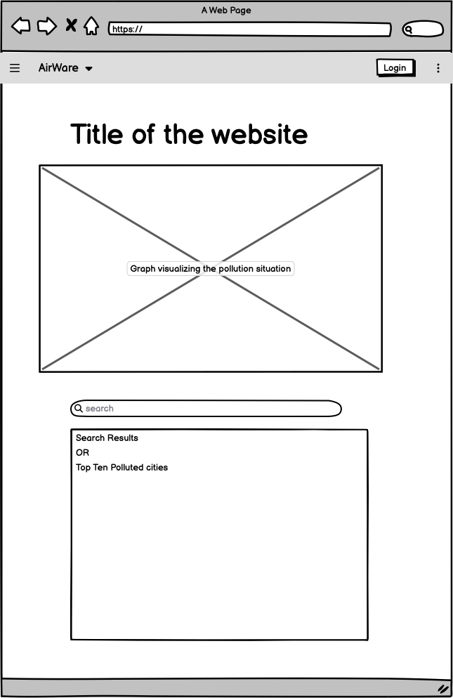
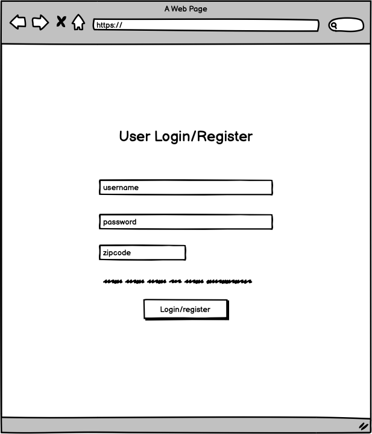
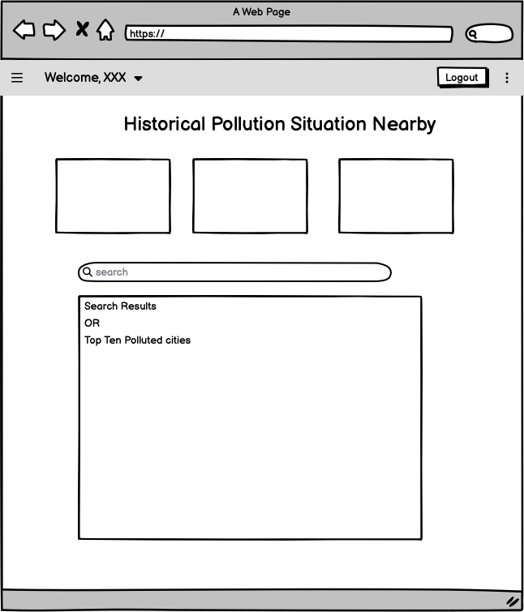
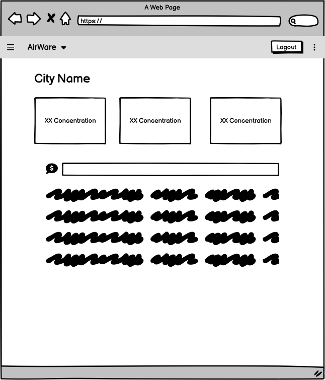

# Project Proposal

## Data stored in the database:

The database will store attributes like location (Country, State, City, etc.), specific pollutants (NO2, CO2, CO, O3, etc.), date, and time. Our data will primarily be sourced from Kaggle. All attributes mentioned above are stored in a .csv file and will be converted to a SQL database.

## Basic functions & complex features of our web application

### 1. A map on the main page. (Shows the overall pollution.)

There is a map on the main page showing the overall pollution status containing all the data in a year in the dataset. For advanced features that we plan to develop, we’ll add a strolling bar to show the status of a selected year between 2000 and 2016.

### 2. Search Bar (Pollutants, States, City)

When there is no search input, the search bar will display the top ten most polluted cities. And users can search based on pollutants, states, or cities. The results will be sorted based on the entity that is selected to search in. Users can also click on each city in the search results to see the detailed pollution information of the specific city.

### 3. Pollution Rank (Green, Yellow, Red)

We divide the ranking into three levels based on the amount of each gas component in the air to vividly show the seriousness of air pollution.

### 4. User Register/Login

Users can register, log in, or log out on the website using their Google accounts or accounts registered on the website. If they put in a zip code after they log in, they will see the pollution situation of the city closest to them. As for advanced features, the users would also be able to comment on each city’s page about their opinions on the air pollution in the city.

### 5. Nearby pollution statistics after login

After users log in, we can locate them through the zip code and display more accurate and relevant air quality information to them.

### 6. Travel and living suggestions

Based on the user’s selected location and time, we will give traveling and living suggestions. If the pollution rank is green, we will suggest popular local eateries, fine dining options, and sights. If the pollution rank is yellow, we will tell the user about the potential health concerns; If the pollution rank is red, we will suggest the user change the travel destination to the recommended one(green pollution rank), provide safety tips, and indicate potential health concerns.

### 7. Creative Components:

1. Progress bar to select the pollution situation from 2000 to 2016: A simple function to show users how our world is becoming more and more polluted.
2. Comment on each city after logging in: After logging in, you can provide comments or feedback on each city individually.
3. Comparison between two regions on specific pollutants: A comparison between two regions on specific pollutants — reveals variations in air quality and environmental conditions, which can impact public health and ecosystem well-being.

## Project Title

AirAware

## Project Summary

Our project aims to raise awareness from people of the air quality in different cities in the United States by providing functionalities for searching and looking into details of the pollution situation of varied cities. Also, we want to hear from our users and thus provide an online forum functionality for them to comment on the air quality of each city.

## Description

By utilizing the pollution database, we want to create an application that tracks the data on pollution in each city across the United States. On the main page, it shows a map visualization of the pollution. The user can search for a specific location. Then, it demonstrates to users the level of air pollution in some areas and gives them travel and living suggestions in those areas. 

## Usefulness

There are existing platforms like the Air Quality Index (AQI) or websites from the Environmental Protection Agency (EPA) that offer similar information. Yet, our projects are able to aggregate different types of pollution data (air, water, and soil) and offer real-time tracking features, allowing users to set alerts and provide predictive analysis based on historical data.

## Realness:

The database will store attributes like location (Country, State, City, etc.), specific pollutants (NO2, CO2, CO, O3, etc.), date, and time, and our data will primarily be sourced from Kaggle.

## **A low-fidelity UI mockup**

This is the main page:

1. We have a Login button on the top-right corner where users can sign up or sign in with their accounts.
2. The title is a slogan that attracts people and makes them aware of the importance of air quality.
3. Under the title, we will visualize the air pollution indexes (APIs) of all regions across the United States. Also, we plan to add a progress bar that users can drag to check APIs in the past.
4. We will implement an air pollution ranking among all cities in the United States based on the values of different air components.
5. Users can use keywords to search for specific locations to check more detailed data.

This is the user login page:

1. Users will provide their username, email, and password in dedicated input fields. The password field will be masked to protect the user's privacy.
2. We will validate the user input to ensure that the data is correctly formatted and mandatory fields are filled out. Provide clear error messages for incorrect information.
3. We will store user passwords by hashing and salting them before storing them in the database.
4. Users' provided email addresses will receive a unique link/token. Users must click the link or enter the token to confirm their email and activate their account.

This is the main page after users login:

1. It shows the historical pollution nearby based on the zip code after users log in.
2. It allows users to search any location and see the pollution around them.
3. From the search result, it can show the user the rank of the pollution in this area and some travel or living suggestions
4. Users can also get some information, like the top ten polluted cities across the United States

This is the page for each city:

1. On the upper part of the page, the concentrations of three pollutants will be displayed, and the background color of the box will vary from Green to Red depending on the concentration of the pollutant relative to the standards.
2. Below the boxes, there would be a chat/comment area where people can put their comments on the city, so people can exchange thoughts on the pollution situation in the city on the site.

## **Project work distribution**

FRONTEND: 

- Fred Hou:
    - Create the main page including a Login button, a dynamic graph, and a search bar.
    - Create the user login page and clickable buttons while communicating with the backend to build a complete login system.
- Leo Huang:
    - Create a user page that contains the nearby pollution by feeding the user location data.
    - Design the search bar interface, which allows users to go to any specific location they want. After jumping to the page that shows each city, it contains detailed air pollutant information and some suggestions.
    - Build a comment system that records comments from other users.

BACKEND: 

- Jeff Fan:
    - Write varied SQL queries to pull desired data from the database/dataset and execute SQL queries using functionalities of backend frameworks.
    - Create API endpoints of cities and pollution status to serve the pollution data for the frontend application to consume.
- Wyatt Huang
    - implement the user register, login, and logout functionality, using their party authentication support
    - Create an API to connect the commenting functionality on the city page with a NoSQL database and implement CRUD(create, read, update, delete) functionalities on the comments.